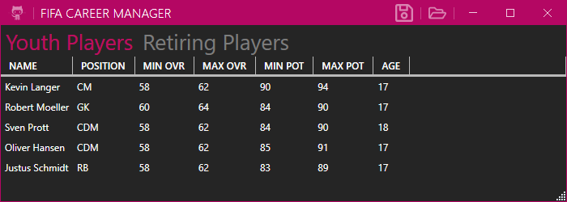
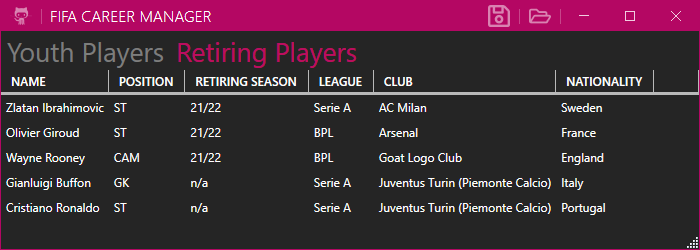

# Fifa Career Manager

Manage and record players from your Youth Academy or keep tabs on players who are about to retire.

Youth Academy Players:

---

Retiring Players:

## Functionality

- Players can be added by double-clicking into the empty `DataGrid`
- The players will be saved into two separate json files in the `ApplicationData` directory
- There is no save button, the players are updated when one of the following actions happen:
  - adding a player (double-clicking onto empty space in the `DataGrid`)
  - updating a player (changing its values)
  - deleting a player (pressing the `Delete` key removes the currently selected player)
